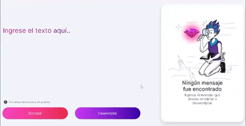

# Encriptador de Texto - Challenge ONE G5
Recorrido de la beca de OracleNextEducation y AluraLatam.<br>
Éste proyecto es un encriptador de texto desarrollado con herramientas web.

## Cómo usar el encriptador de texto

<b>1.</b> (Opcional) Puedes clonar el repositorio en tu máquina local usando el siguiente comando:
```
git clone https://github.com/DanielHerrer/Challenge-Oracle-ONE-G5-EncriptadorDeTexto
```
<b>2.</b> Accede a la página web:

🔗 <a href="https://danielherrer.github.io/Challenge-Oracle-ONE-G5-EncriptadorDeTexto/web_AluraEncriptador/" target="_blank" rel="noopener noreferrer">¡Puedes acceder haciendo click aquí!</a> 🔗

<b>3.</b> Empieza a encriptar!:



## Tecnologías Utilizadas

- HTML5 / CSS3
- JavaScript
- Visual Studio Code

## Licencia © [Daniel Franco Herrera](https://www.linkedin.com/in/danielfrancoherrera/)
